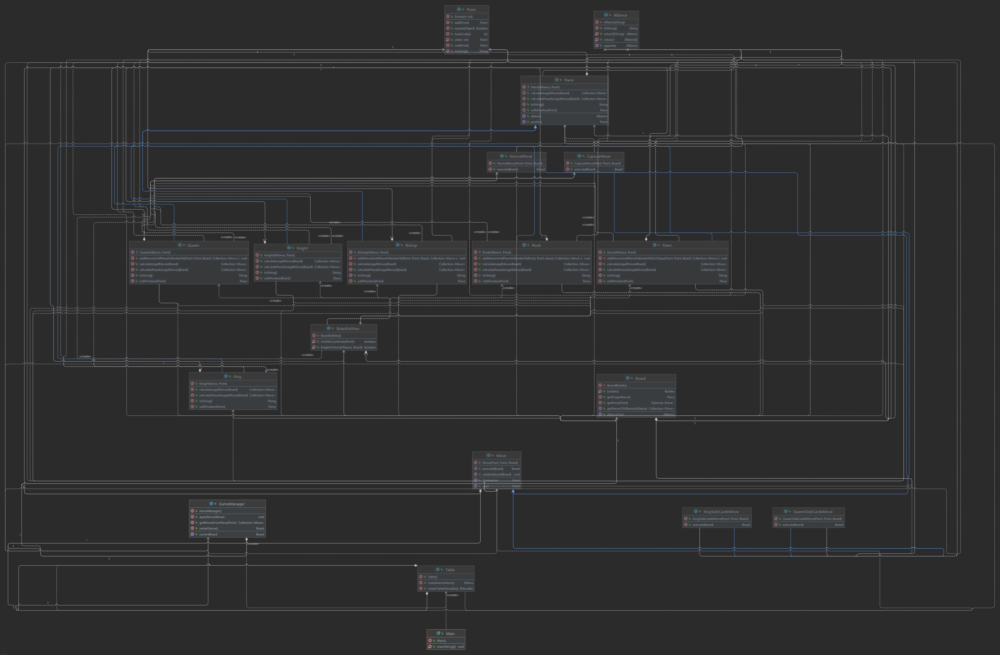

# Chessgame | imd0040-trabalho-final

## Notas prévias

Foram dadas duas semanas para a entrega do trabalho final, mas infelizmente só tivemos a oportunidade de começar o projeto na segunda semana. Por conta disso, não pudemos preencher todos os requisitos do trabalho. Mesmo assim, fizemos o máximo possível até a data final.

## Propósito do projeto

O Chessgame é um clássico jogo de xadrez, com uma interface mínima e uma engine simplificada, e construído pelo Gradle. O projeto foi uma oportunidade para aprendermos a utilizar o Swing Framework do Java e praticar as funcionalidades únicas da linguagem. Ainda é um projeto incompleto, portanto notará que faltam algumas funcionalidades importantes.

## Organização do projeto com o respectivo diagrama de classes

Segue a árvore de diretórios contendo os principais arquivos do repositório:
```
chessgame
│   README.md
│   CONVENTION.md    
│   gradlew
|   ...
|
└───src
│   └───main
|   |   └───java.com.chessgame
│   |       |   Main.java
│   |       |
│   |       └───gui
│   |       |   |   Table.java
│   |       |
│   |       └───engine
│   |           |   GameManager.java
│   |           |   Point.java
│   |           |
│   |           └───board
│   |           |   |   Board.java
│   |           |   |   BoardUtilities.java
│   |           |
│   |           └───move
│   |           |   |   Move.java
│   |           |   |   MoveUtils.java
│   |           |   |   NormalMove.java
│   |           |   |   CaptureMove.java
│   |           |   |   KingSideCastleMove.java
│   |           |   |   QueenSideCastleMove.java
│   |           |   |   PromotionMove.java
│   |           |   |   PromotionPrompt.java
│   |           |
│   |           └───piece
│   |               |   Piece.java
│   |               |   King.java
│   |               |   Queen.java
│   |               |   Rook.java
│   |               |   Bishop.java
│   |               |   Knight.java
│   |               |   Pawn.java
│   |               |   Alliance.java
│   | 
│   └───resource
│       │   whiteKing.png
│       │   blackKing.png
│       │   whiteQueen.png
│       │   blackQueen.png
│       │   whiteRook.png
│       │   blackRook.png
│       │   whiteBishop.png
│       │   blackBishop.png
│       │   whiteKnight.png
│       │   blackKnight.png
│       │   whitePawn.png
│       │   blackPawn.png
|
└───resource
    │   fullDiagram.png
    │   smallDiagram.png
```

E seguem os diagramas de classe do projeto:



## Instruções de como realizar o build

Construindo no Linux:
```sh
./gradlew build
```

## Instruções de como executar

Executando no Linux:
```sh
./gradlew run
```
